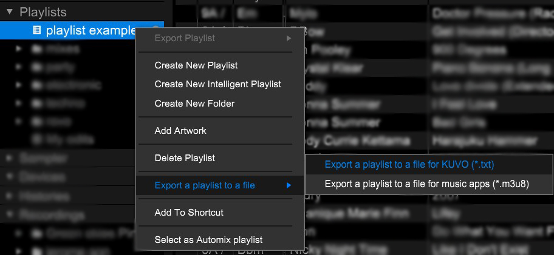
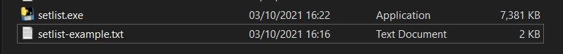
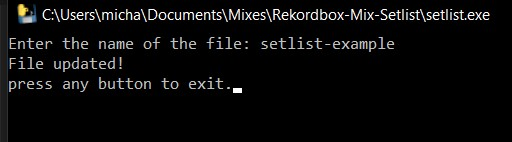
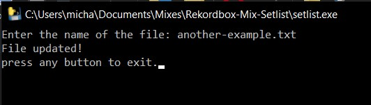
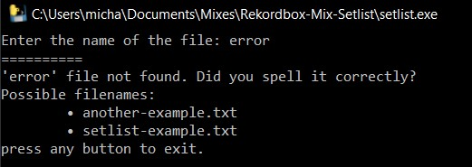
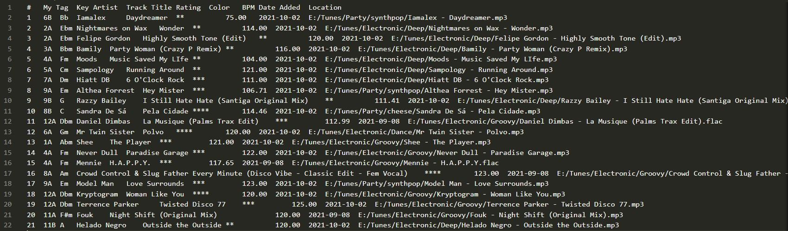
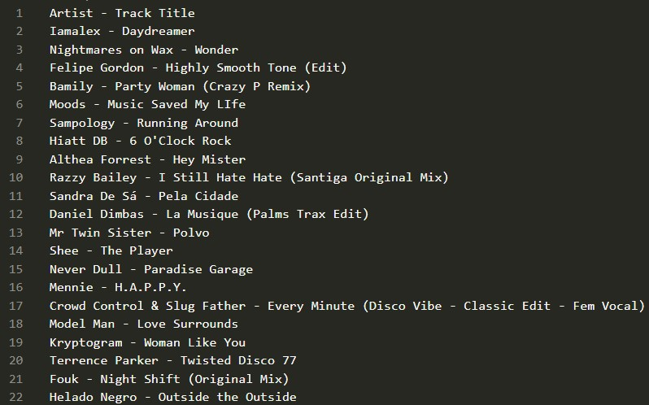

# Rekordbox-Mix-Setlist
Really simple executable used to get a setlist .txt file from Rekordbox.
Executable created using pyinstaller.

---

# Steps

### 1. Export playlist to a file for Kuvo.

 

### 2. Make sure the executable is in the same location as the playlist.

 

### 3. Double-click the executable and enter the text file name.

*Without .txt extension*

*With .txt extension*

---

# Errors

### Files that don't exist will print out possible .txt options in the current directory.

---

# Before and After.

